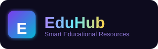
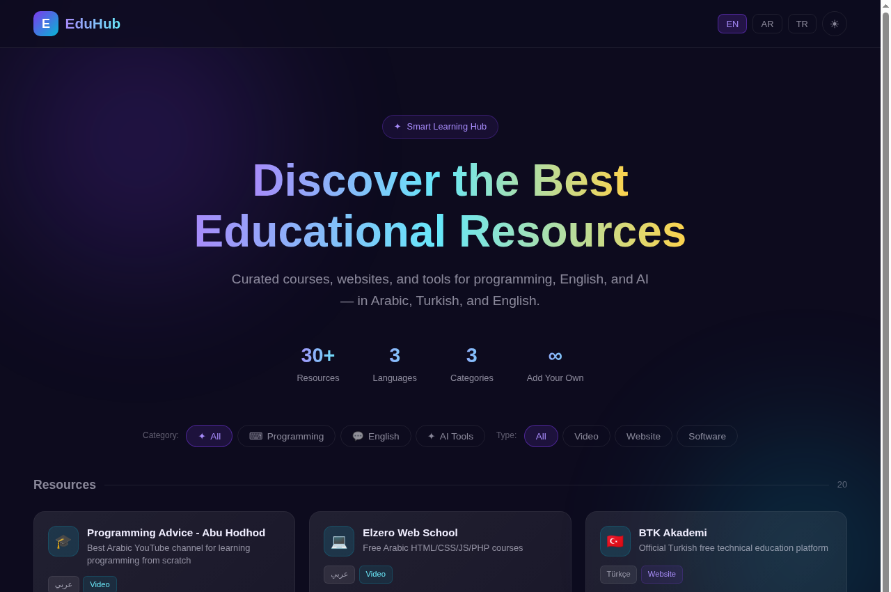
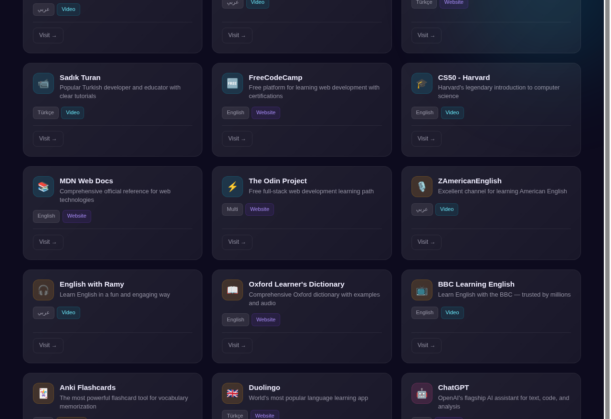
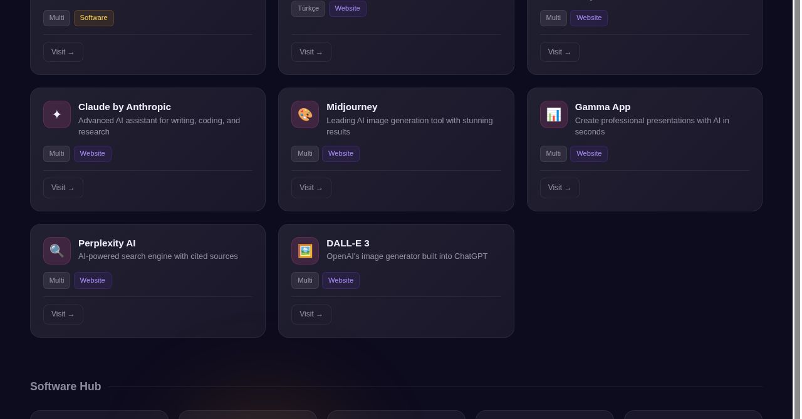
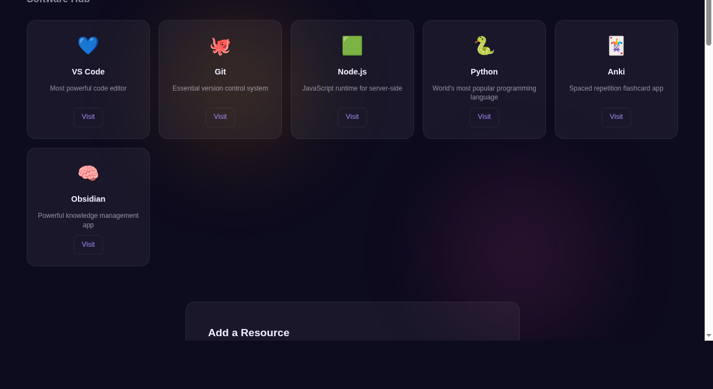

<div align="center">



<br/>

<p>
  
  
  
  
</p>

<h3>✦ مركز التعلم الذكي · Akıllı Öğrenme Merkezi · Smart Learning Hub ✦</h3>

<p><em>كورسات ومواقع وأدوات منتقاة في البرمجة والإنجليزية والذكاء الاصطناعي</em></p>

<a href="https://github.com/Zaidalsalmei/Education/blob/main/eduhub.html"><strong>🚀 عرض الموقع المباشر</strong></a>

</div>

---

## 📖 نظرة عامة

**EduHub** هو منصة تعليمية أنيقة وحديثة تجمع أفضل المصادر التعليمية في مكان واحد، مصممة خصيصاً للمتعلمين الراغبين في الارتقاء بمهاراتهم في **البرمجة**، **اللغة الإنجليزية**، و**أدوات الذكاء الاصطناعي**.

> 🌍 يدعم الموقع ثلاث لغات: **العربية** · **التركية** · **الإنجليزية**

---

## 🖼️ لقطات الشاشة

### 🏠 الصفحة الرئيسية

<div align="center">
  
</div>

<br/>

### 📚 المصادر التعليمية

<div align="center">
  
</div>

<br/>

### 🛠️ مركز التحميل (Software Hub)

<div align="center">
  
</div>

<br/>

### ➕ إضافة مصدر جديد

<div align="center">
  
</div>

---

## ✨ المميزات

<table>
<tr>
<td width="50%">

### 🎨 تصميم عصري
- خلفية **Aurora** متحركة بألوان متدرجة
- تأثير **Glassmorphism** على البطاقات
- وضع **مظلم وفاتح** قابل للتبديل
- تصميم متجاوب مع جميع الأجهزة

</td>
<td width="50%">

### 🌐 دعم متعدد اللغات
- **العربية** مع دعم RTL كامل
- **التركية** للمتعلمين الأتراك
- **الإنجليزية** للمحتوى الدولي
- تبديل فوري بين اللغات

</td>
</tr>
<tr>
<td width="50%">

### 🔍 بحث وتصفية متقدمة
- تصفية حسب **القسم**: برمجة · إنجليزي · AI
- تصفية حسب **النوع**: فيديو · موقع · برنامج
- عرض ديناميكي فوري بدون إعادة تحميل

</td>
<td width="50%">

### ➕ مشاركة المجتمع
- إضافة مصادر جديدة بسهولة
- حفظ المصادر الشخصية في المتصفح
- مشاركة الكورسات والمواقع مع الآخرين

</td>
</tr>
</table>

---

## 📂 الأقسام

### ⌨️ البرمجة
| المصدر | النوع | اللغة |
|--------|-------|-------|
| 🎬 Elzero Web School | فيديو | عربي |
| 🎓 Kodlama.io | موقع | تركي |
| 🏛️ BTK Akademi | فيديو | تركي |
| 👨‍💻 Sadık Turan | فيديو | تركي |
| 🆓 FreeCodeCamp | موقع | إنجليزي |
| 🎓 CS50 - Harvard | فيديو | إنجليزي |
| 📚 MDN Web Docs | موقع | إنجليزي |
| ⚡ The Odin Project | موقع | إنجليزي |

### 💬 اللغة الإنجليزية
| المصدر | النوع | اللغة |
|--------|-------|-------|
| 🎙 ZAmericanEnglish | فيديو | عربي |
| 🎧 English with Ramy | فيديو | عربي |
| 📖 Oxford Learner's Dictionary | موقع | إنجليزي |
| 📺 BBC Learning English | فيديو | إنجليزي |
| 🃏 Anki Flashcards | برنامج | متعدد |
| 🇬🇧 Duolingo | موقع | تركي |

### 🤖 أدوات الذكاء الاصطناعي
| المصدر | الوصف |
|--------|-------|
| 🤖 ChatGPT | مساعد الذكاء الاصطناعي من OpenAI |
| ✦ Claude by Anthropic | مساعد متقدم للتحليل والكتابة |
| 🎨 Midjourney | توليد الصور بالذكاء الاصطناعي |
| 📊 Gamma App | عروض تقديمية احترافية بالـ AI |
| 🔍 Perplexity AI | محرك بحث ذكي مع المصادر |
| 🖼 DALL-E 3 | مولّد صور OpenAI |

---

## 🛠️ مركز البرمجيات

| البرنامج | الوصف |
|----------|-------|
| 💙 VS Code | أقوى محرر كود |
| 🐙 Git | نظام التحكم بالإصدارات |
| 🟩 Node.js | بيئة تشغيل JavaScript |
| 🐍 Python | لغة البرمجة الأكثر شعبية |
| 🃏 Anki | تطبيق البطاقات الذكية |
| 🧠 Obsidian | أداة قوية لتنظيم الملاحظات |

---

## 🚀 كيفية الاستخدام

```bash
# استنساخ المشروع
git clone https://github.com/Zaidalsalmei/Education.git

# فتح الموقع
open eduhub.html
```

أو ببساطة افتح ملف `eduhub.html` مباشرةً في أي متصفح حديث — لا يحتاج إلى خادم أو تثبيت.

---

## 🎨 التقنيات المستخدمة

<div align="center">

| التقنية | الاستخدام |
|---------|-----------|
| `HTML5` | هيكل الصفحة |
| `CSS3` | التصميم والتأثيرات البصرية |
| `Vanilla JavaScript` | التفاعل والـ i18n |
| `Google Fonts` | خطوط Outfit و Tajawal |
| `localStorage` | حفظ مصادر المستخدم |

</div>

---

## 📊 إحصائيات الموقع

<div align="center">

| 📦 المصادر | 🌍 اللغات | 📂 الأقسام | 🛠️ البرمجيات |
|:-----------:|:---------:|:----------:|:------------:|
| **30+** | **3** | **3** | **6** |

</div>

---

<div align="center">

**EduHub © 2025** — للمتعلمين في كل مكان 🌍

*صُنع بـ ❤️ لدعم مسيرتك التعليمية*

</div>
